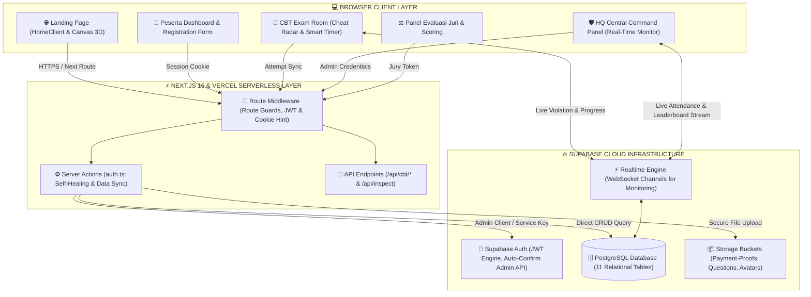
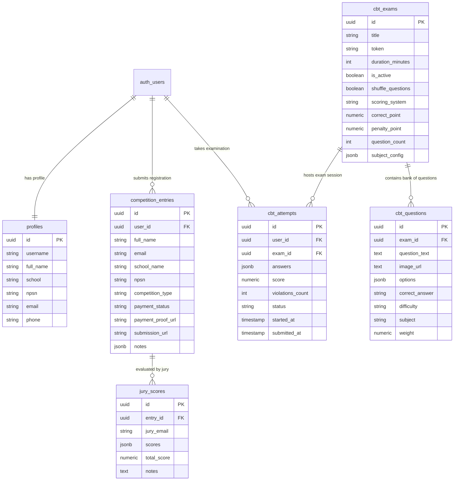
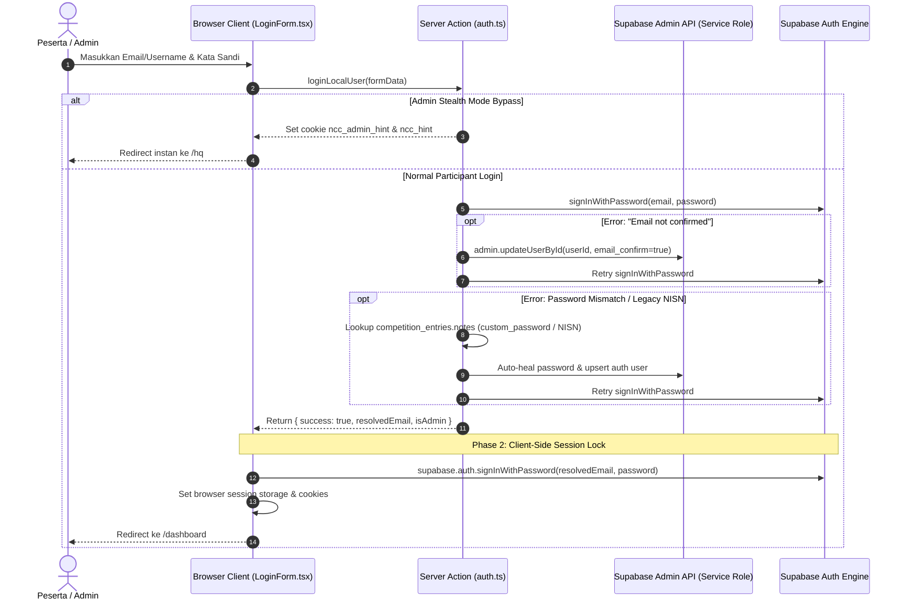

<p align="center">
  
</p>

<h1 align="center">🏆 National Creativity Competition (NCC)</h1>

<p align="center">
  <strong>Platform Kompetisi Nasional Full-Stack & Computer-Based Testing (CBT) Modern</strong><br>
  Dirancang dengan Next.js 16 (App Router), Supabase PostgreSQL, Realtime Proctoring, dan Tailwind CSS v4.
</p>

<p align="center">
  <a href="https://national-creativty-competition.vercel.app"></a>
  <a href="https://github.com/luthfi5372/National-Creativty-Competition"></a>
  
  
  
  
  
</p>

---

## 📋 Daftar Isi

1. [Visualisasi Arsitektur Sistem](#-visualisasi-arsitektur-sistem)
2. [Visualisasi Database Schema (ERD)](#-visualisasi-database-schema-erd)
3. [Alur Autentikasi & Self-Healing](#-alur-autentikasi--self-healing)
4. [Central Command HQ (Admin Panel)](#-central-command-hq-admin-panel)
5. [Sistem CBT & Real-Time Proctoring](#-sistem-cbt--real-time-proctoring)
6. [Struktur Folder & Komponen](#-struktur-folder--komponen)
7. [Environment Variables](#-environment-variables)
8. [Panduan Menjalankan Lokal](#-panduan-menjalankan-lokal)
9. [Halaman & Route Guards](#-halaman--route-guards)
10. [Panduan Modifikasi Setiap Fitur](#-panduan-modifikasi-setiap-fitur)
11. [Troubleshooting & Solusi Error](#-troubleshooting--solusi-error)

---

## 🏗 Visualisasi Arsitektur Sistem

Diagram interaktif di bawah menggambarkan bagaimana setiap layer dari antarmuka pengguna hingga infrastruktur database terhubung secara realtime:



---

## 🗄 Visualisasi Database Schema (ERD)

Relasi antar tabel utama di PostgreSQL Supabase digambarkan pada diagram Entity-Relationship berikut:



---

## 🔑 Alur Autentikasi & Self-Healing

Sistem autentikasi dilengkapi dengan mekanisme **Self-Healing** dan **Dual-Phase Token Persistence** untuk mengatasi email unconfirmed dan mismatch sesi server-client:



---

## 🛡 Central Command HQ (Admin Panel)

<p align="center">
  
</p>

File Utama: `src/app/hq/page.tsx`  
Akses: Khusus Admin (`admin@ncc.id`, `admin1@ncc.id`, `halo.ncc@gmail.com`)

### Fitur-Fitur Utama HQ

| Modul | Deskripsi | File Implementasi |
|-------|-----------|-------------------|
| **Sebaran Geografis** | Peta interaktif 34 provinsi dengan indikator kepadatan persentase pendaftar | `src/components/IndonesiaMap.tsx` |
| **Verifikasi Pembayaran** | Approve/Reject bukti bayar slip transfer secara real-time | `src/components/hq/VerificationTab.tsx` |
| **Participant Registry** | CRUD peserta, pencarian cerdas, filter instansi/NPSN, dan kartu peserta | `src/components/hq/UserRegistryTab.tsx` |
| **Export Data CSV** | Unduh seluruh data registrasi dalam format CSV rapi dengan auto-quoting | `src/app/hq/page.tsx` |
| **Live Broadcast** | Kirim pengumuman darurat langsung ke banner layar peserta | `src/app/hq/llms/broadcast/page.tsx` |
| **QR Code Scanner** | Validasi kehadiran peserta di venue melalui pemindaian kartu ID | `html5-qrcode` integration |

---

## 📝 Sistem CBT & Real-Time Proctoring

<p align="center">
  
</p>

File Ruang Ujian: `src/app/ujian/[exam_id]/page.tsx`  
File Monitor Admin: `src/app/hq/llms/[exam_id]/monitor/page.tsx`

### Siklus Pengerjaan Ujian (CBT Lifecycle)

```mermaid
flowchart LR
    A["🔑 Masuk Token Ujian"] --> B["📋 Dashboard Verifikasi Peserta"]
    B --> C["⏱️ Mulai Ujian (started_at terkunci)"]
    C --> D["📝 Pengerjaan Soal (Smart Shuffle & Mapel)"]
    
    subgraph Proctoring["🛡️ Proctoring Radar Engine"]
        D -.->|Deteksi Tab Switch / Blur| W1["⚠️ Peringatan Pelanggaran #1"]
        W1 -.->|Deteksi Copy Paste / Esc| W2["⚠️ Peringatan Pelanggaran #2"]
        W2 -.->|Pelanggaran ke-3| W3["🚨 Auto-Submit Paksa"]
    end

    D -->|Waktu Habis / Tombol Selesai| Submit["🏁 Finalisasi & Submit Jawaban"]
    W3 --> Submit
    Submit --> Scoring["📊 Auto-Grading (Fixed / Custom / Penalty)"]
    Scoring --> Leaderboard["🏆 Real-Time Leaderboard HQ"]
```



### Fitur Kunci Sistem CBT
1. **Smart Question Bank & Subject Config**: Soal dapat diacak secara umum atau dibagi per mata pelajaran (misal: 20 Matematika, 15 Fisika, 15 Kimia dari bank 200 soal).
2. **Resume Timer Resilient**: Jika peserta me-refresh halaman atau internet terputus, durasi waktu dihitung akurat dari selisih `started_at` di database terhadap waktu sekarang.
3. **Cheat Radar**: Mendeteksi perpindahan tab browser, minimize, pembukaan devtools, dan kombinasi shortcut keyboard.
4. **Skema Penilaian Multi-Mode**:
   - `Fixed`: Poin seragam untuk setiap soal benar.
   - `Custom`: Poin berbobot per butir soal.
   - `Penalty`: Pengurangan skor jika jawaban salah (sistem minus).

---

## 📁 Struktur Folder & Komponen

```
National-Creativty-Competition-main/
├── public/                           ← Aset statis (logo, gambar lomba, guidebook)
│   ├── docs/                         ← Gambar visualisasi README
│   │   ├── banner.jpg                ← Hero Banner NCC 2026
│   │   ├── hq_preview.jpg            ← Preview Dashboard Central Command HQ
│   │   └── cbt_preview.jpg           ← Preview Ruang Ujian CBT & Radar Anti-Cheat
│   ├── mascots.png                   ← Maskot resmi Nicco & Nicci
│   └── juknis/                       ← Petunjuk teknis PDF tiap cabang lomba
│
├── src/
│   ├── app/                          ← App Router Pages
│   │   ├── page.tsx                  ← Landing page utama
│   │   ├── login/                    ← Form login peserta & admin
│   │   ├── register/                 ← Form registrasi umum
│   │   ├── daftar/                   ← Form registrasi berbasis NPSN sekolah
│   │   ├── dashboard/                ← Portal peserta terdaftar
│   │   ├── hq/                       ← Central Command Admin HQ
│   │   │   ├── llms/                 ← CBT Exam Manager & Question Bank
│   │   │   │   └── [exam_id]/        ← Monitor ujian, soal, dan leaderboard
│   │   │   └── participants/         ← Manajemen data peserta lanjutan
│   │   ├── ujian/                    ← Portal pelaksanaan CBT peserta
│   │   │   └── [exam_id]/            ← Ruang pengerjaan ujian aktif
│   │   ├── juri/                     ← Portal juri untuk evaluasi karya
│   │   └── actions/auth.ts           ← Server actions autentikasi & database
│   │
│   ├── components/                   ← Komponen UI Reusable
│   │   ├── Navbar.tsx                ← Navigasi responsif dengan status login
│   │   ├── HeroSection.tsx           ← Hero interaktif & CTA pendaftaran
│   │   ├── TimelineSection.tsx       ← Timeline roadmap kegiatan NCC
│   │   ├── CategoryCards.tsx         ← Kartu 4 cabang lomba & rincian biaya
│   │   ├── IndonesiaMap.tsx          ← Visualisasi sebaran peserta per provinsi
│   │   ├── dashboard/                ← Komponen dashboard peserta (ID Card, Status)
│   │   ├── exam/CheatRadar.tsx       ← Widget radar anti-cheat visual
│   │   └── hq/                       ← Widget tab panel admin HQ
│   │
│   ├── lib/supabase/                 ← Klien Supabase (Browser, Server SSR, Admin)
│   ├── hooks/                        ← Custom React Hooks (useLiveStats, useAdvancedProctoring)
│   └── middleware.ts                 ← Global route guard & security headers
```

---

## 🔐 Environment Variables

Konfigurasikan variabel lingkungan berikut di `.env.local` untuk lokal dan di **Vercel Project Settings > Environment Variables** untuk produksi:

```env
# URL Instance Supabase
NEXT_PUBLIC_SUPABASE_URL=https://afwuyizfsoevcffnhfbk.supabase.co

# Kunci Anonim Publik (Client-Side Safe)
NEXT_PUBLIC_SUPABASE_ANON_KEY=eyJhbGciOiJIUzI1NiIsInR5cCI6IkpXVCJ9...

# Kunci Service Role (Bypass RLS & Auto-Confirm Email - WAJIB DI VERCEL!)
SUPABASE_SERVICE_ROLE_KEY=eyJhbGciOiJIUzI1NiIsInR5cCI6IkpXVCJ9...

# Integrasi Email Transaksional (Opsional)
RESEND_API_KEY=re_xxxxxxxxxxxx
```

---

## 🚀 Panduan Menjalankan Lokal

```bash
# 1. Kloning repository dari GitHub
git clone https://github.com/luthfi5372/National-Creativty-Competition.git
cd National-Creativty-Competition

# 2. Pasang semua dependensi modul
npm install

# 3. Siapkan file environment variables lokal
cp .env.example .env.local
# Lengkapi kredensial Supabase Anda di .env.local

# 4. Jalankan development server
npm run dev

# 5. Buka di browser: http://localhost:3000
```

---

## 🚦 Halaman & Route Guards

Sistem proteksi rute diatur secara terpusat pada file `src/middleware.ts`:

| Route Path | Level Akses | Kebijakan Redirect Jika Gagal |
|------------|-------------|-------------------------------|
| `/` | **Publik** | Dapat diakses siapapun |
| `/login`, `/register`, `/daftar` | **Publik** | Jika sudah login, diarahkan ke `/dashboard` |
| `/dashboard/*` | **Peserta Terotentikasi** | Redirect ke `/login` jika tidak ada sesi |
| `/hq/*` | **Khusus Admin** | Redirect ke `/login` jika anon, redirect ke `/dashboard` jika bukan admin |
| `/juri/*` | **Admin atau Juri** | Redirect ke `/login` jika anon, redirect ke `/dashboard` jika tidak berhak |
| `/ujian/[exam_id]` | **Peserta Terotentikasi** | Wajib verifikasi sesi akun & token ujian aktif |

---

## 🔧 Panduan Modifikasi Setiap Fitur

### 1. Mengubah Kategori Lomba & Biaya Pendaftaran
Edit berkas: `src/components/CategoryCards.tsx` dan `src/components/dashboard/RegistrationModal.tsx`
```tsx
// Contoh penyesuaian kategori di CategoryCards.tsx:
export const CATEGORIES = [
  {
    name: "Olimpiade MIPA",
    price: "Rp 150.000",
    color: "from-blue-500 to-indigo-600",
    description: "Kompetisi Matematika dan IPA tingkat nasional...",
  },
  // Tambah kategori baru di sini
];
```

### 2. Mengubah Timeline & Jadwal Kegiatan
Edit berkas: `src/components/TimelineSection.tsx`
```tsx
const timelineEvents = [
  {
    date: "10 April 2026",
    title: "Pendaftaran Gelombang 1",
    desc: "Pembukaan registrasi awal bagi seluruh kontingen sekolah.",
  },
  // Perbarui jadwal tanggal di sini
];
```

### 3. Menambah Akun Admin atau Juri Baru
Tambahkan email admin pada daftar string di:
- `src/middleware.ts` → array `ADMIN_EMAILS`
- `src/app/actions/auth.ts` → array `adminEmails`
- `src/app/juri/page.tsx` → array `JURI_EMAILS`

### 4. Menyesuaikan Aturan Anti-Cheat Ujian (Batas Maksimal Pelanggaran)
Edit berkas: `src/app/ujian/[exam_id]/page.tsx`
```tsx
// Cari baris deklarasi batas pelanggaran:
const MAX_VIOLATIONS = 3; // Ubah angka toleransi (misal 5 kali peringatan)
```

---

## 🐛 Troubleshooting & Solusi Error

### 🔴 Masalah 1: Peserta Bisa Daftar tapi Tidak Bisa Login
- **Penyebab**: Email Supabase memerlukan verifikasi manual sementara user belum klik tautan konfirmasi.
- **Solusi yang Diterapkan**: Server action `loginLocalUser` dan `syncEntryOnDaftar` telah dilengkapi **Auto-Confirm Email via Admin API**. Pastikan variable `SUPABASE_SERVICE_ROLE_KEY` telah terpasang di Vercel Dashboard agar fungsi auto-confirm aktif di serverless.

### 🔴 Masalah 2: Sesi Peserta Hilang Saat Masuk Halaman Dashboard
- **Penyebab**: Session cookie Supabase hanya tersimpan di server header dan belum tersinkronisasi di storage browser.
- **Solusi**: Form login (`src/app/login/LoginForm.tsx`) kini menjalankan `signInWithPassword` dua tahap: validasi via Server Action, lalu locking session langsung melalui browser Supabase Client.

### 🔴 Masalah 3: Soal Ujian dengan Gambar Gagal Diunggah
- **Penyebab**: Bucket storage `question-images` di Supabase belum dibuat atau policy RLS-nya terbatas.
- **Solusi**: Pastikan bucket `question-images` berstatus **Public** dan memiliki policy `FOR ALL USING (true) WITH CHECK (true)` pada Supabase SQL Editor.

---

<p align="center">
  <sub>Dibuat dengan dedikasi untuk kesuksesan <strong>National Creativity Competition</strong>.</sub><br>
  <sub>© 2026 Tim Pengembang NCC. Hak cipta dilindungi.</sub>
</p>
