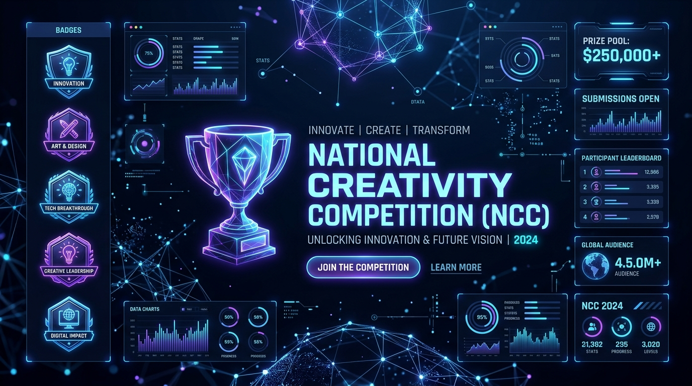
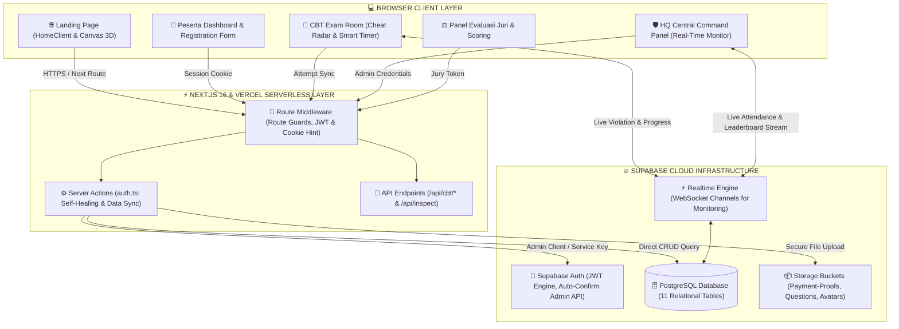
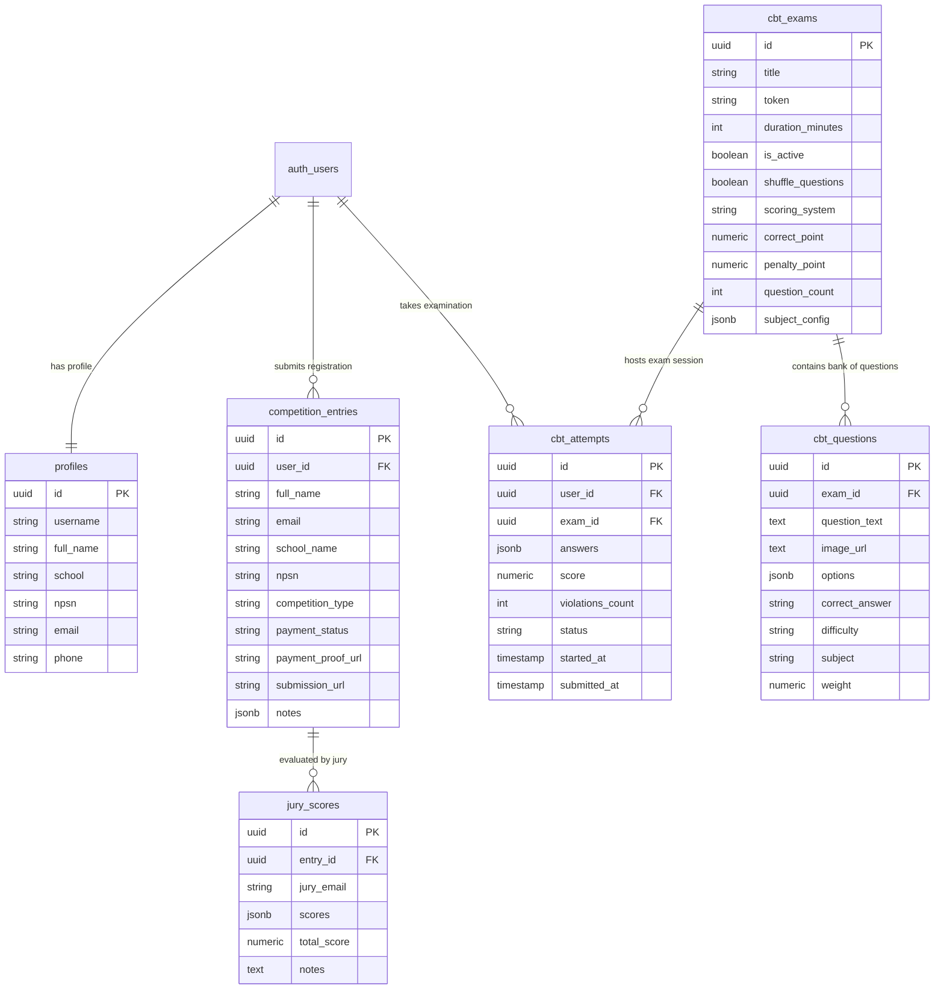
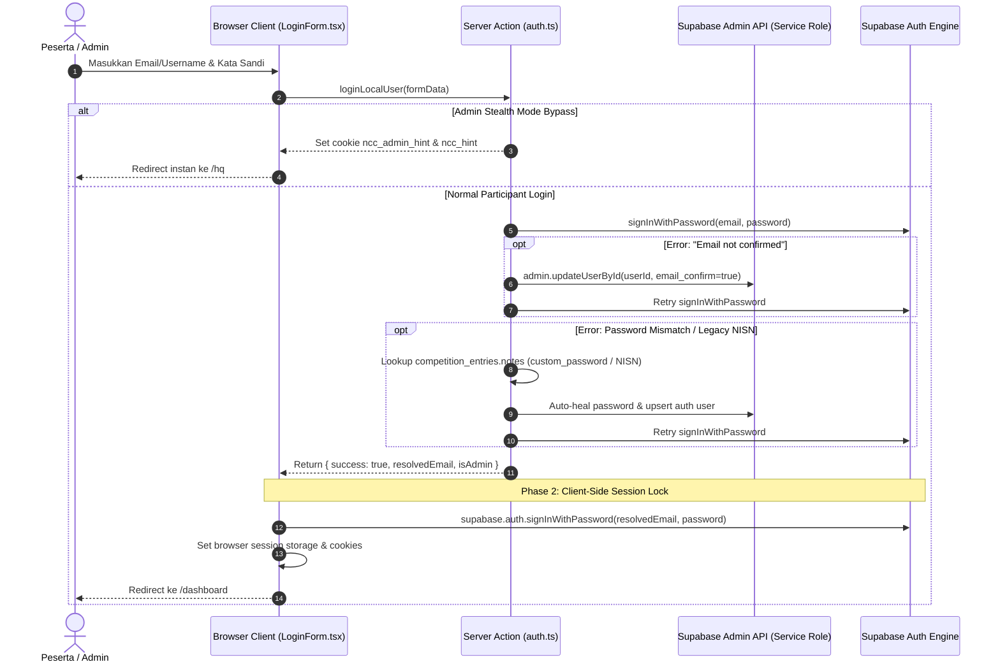
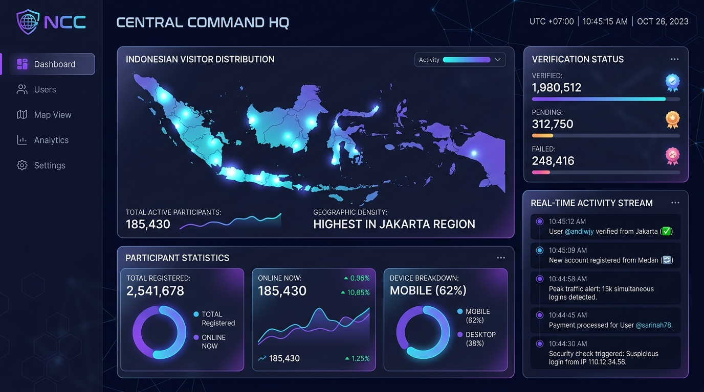
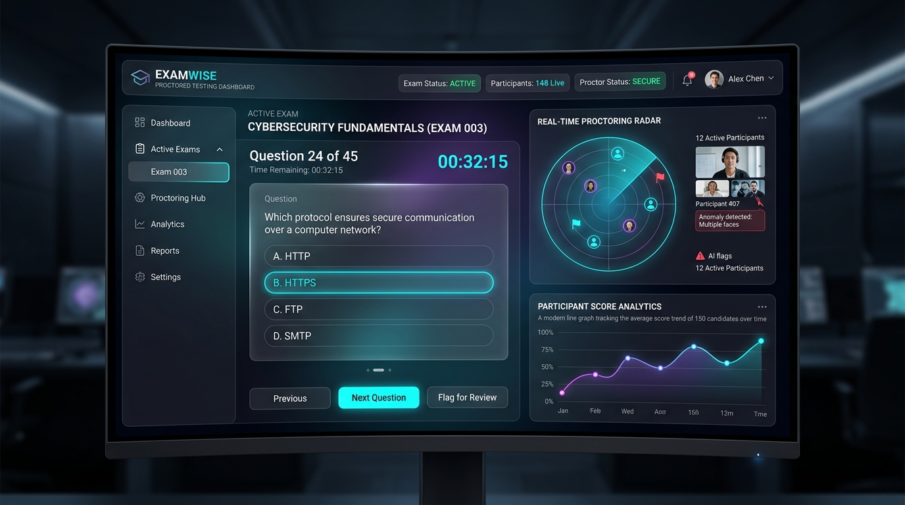

<p align="center">
  
</p>

<h1 align="center">🏆 National Creativity Competition (NCC)</h1>

<p align="center">
  <strong>Platform Kompetisi Nasional Full-Stack & Computer-Based Testing (CBT) Modern</strong><br>
  Dirancang dengan Next.js 16 (App Router), Supabase PostgreSQL, Realtime Proctoring, dan Tailwind CSS v4.
</p>

<p align="center">
  <a href="https://national-creativty-competition.vercel.app"></a>
  <a href="https://github.com/luthfi5372/National-Creativty-Competition"></a>
  
  
  
  
  
</p>

---

## 📋 Daftar Isi

1. [Visualisasi Arsitektur Sistem](#-visualisasi-arsitektur-sistem)
2. [Visualisasi Database Schema (ERD)](#-visualisasi-database-schema-erd)
3. [Alur Autentikasi & Self-Healing](#-alur-autentikasi--self-healing)
4. [Central Command HQ (Admin Panel)](#-central-command-hq-admin-panel)
5. [Sistem CBT & Real-Time Proctoring](#-sistem-cbt--real-time-proctoring)
6. [Struktur Folder & Komponen](#-struktur-folder--komponen)
7. [Environment Variables](#-environment-variables)
8. [Panduan Menjalankan Lokal](#-panduan-menjalankan-lokal)
9. [Halaman & Route Guards](#-halaman--route-guards)
10. [Panduan Modifikasi & Kodingan Bebas Error (Developer's Manual)](#-panduan-modifikasi--kodingan-bebas-error-developers-manual)
    - [Tabel Referensi Cepat: "Mau Ubah Apa? Edit File Ini!"](#-tabel-referensi-cepat-mau-ubah-apa-edit-file-ini)
    - [Aturan Emas Menghindari Kesalahan Kodingan](#-aturan-emas-menghindari-kesalahan-kodingan)
    - [Skenario 1: Menambah Cabang Lomba Baru](#skenario-1-menambah-cabang-lomba-baru-full-stack)
    - [Skenario 2: Menambah Kolom Baru Data Peserta](#skenario-2-menambah-kolom-baru-data-peserta-contoh-no-wa-wali--ukuran-baju)
    - [Skenario 3: Menambah / Mengubah Akun Admin atau Juri](#skenario-3-menambah--mengubah-akun-admin-atau-juri)
    - [Skenario 4: Mengatur Ujian CBT, Durasi, Soal Mapel, & Anti-Cheat](#skenario-4-mengatur-ujian-cbt-durasi-soal-mapel--anti-cheat)
    - [Skenario 5: Mengubah Teks Landing Page, FAQ, Peta, & Sponsor](#skenario-5-mengubah-teks-landing-page-faq-peta--sponsor)
    - [Skenario 6: Menambah Server Action Baru yang Aman](#skenario-6-menambah-server-action-baru-yang-aman)
    - [Jebakan Kodingan Umum & Cara Mengatasinya](#-jebakan-kodingan-umum-gotchas--cara-mengatasinya)
11. [Troubleshooting & Solusi Error](#-troubleshooting--solusi-error)

---

## 🏗 Visualisasi Arsitektur Sistem

Diagram interaktif di bawah menggambarkan bagaimana setiap layer dari antarmuka pengguna hingga infrastruktur database terhubung secara realtime:



---

## 🗄 Visualisasi Database Schema (ERD)

Relasi antar tabel utama di PostgreSQL Supabase digambarkan pada diagram Entity-Relationship berikut:



---

## 🔑 Alur Autentikasi & Self-Healing

Sistem autentikasi dilengkapi dengan mekanisme **Self-Healing** dan **Dual-Phase Token Persistence** untuk mengatasi email unconfirmed dan mismatch sesi server-client:



---

## 🛡 Central Command HQ (Admin Panel)

<p align="center">
  
</p>

File Utama: `src/app/hq/page.tsx`  
Akses: Khusus Admin (`admin@ncc.id`, `admin1@ncc.id`, `halo.ncc@gmail.com`)

### Fitur-Fitur Utama HQ

| Modul | Deskripsi | File Implementasi |
|-------|-----------|-------------------|
| **Sebaran Geografis** | Peta interaktif 34 provinsi dengan indikator kepadatan persentase pendaftar | `src/components/IndonesiaMap.tsx` |
| **Verifikasi Pembayaran** | Approve/Reject bukti bayar slip transfer secara real-time | `src/components/hq/VerificationTab.tsx` |
| **Participant Registry** | CRUD peserta, pencarian cerdas, filter instansi/NPSN, dan kartu peserta | `src/components/hq/UserRegistryTab.tsx` |
| **Export Data CSV** | Unduh seluruh data registrasi dalam format CSV rapi dengan auto-quoting | `src/app/hq/page.tsx` |
| **Live Broadcast** | Kirim pengumuman darurat langsung ke banner layar peserta | `src/app/hq/llms/broadcast/page.tsx` |
| **QR Code Scanner** | Validasi kehadiran peserta di venue melalui pemindaian kartu ID | `html5-qrcode` integration |

---

## 📝 Sistem CBT & Real-Time Proctoring

<p align="center">
  
</p>

File Ruang Ujian: `src/app/ujian/[exam_id]/page.tsx`  
File Monitor Admin: `src/app/hq/llms/[exam_id]/monitor/page.tsx`

### Siklus Pengerjaan Ujian (CBT Lifecycle)

```mermaid
flowchart LR
    A["🔑 Masuk Token Ujian"] --> B["📋 Dashboard Verifikasi Peserta"]
    B --> C["⏱️ Mulai Ujian (started_at terkunci)"]
    C --> D["📝 Pengerjaan Soal (Smart Shuffle & Mapel)"]
    
    subgraph Proctoring["🛡️ Proctoring Radar Engine"]
        D -.->|Deteksi Tab Switch / Blur| W1["⚠️ Peringatan Pelanggaran #1"]
        W1 -.->|Deteksi Copy Paste / Esc| W2["⚠️ Peringatan Pelanggaran #2"]
        W2 -.->|Pelanggaran ke-3| W3["🚨 Auto-Submit Paksa"]
    end

    D -->|Waktu Habis / Tombol Selesai| Submit["🏁 Finalisasi & Submit Jawaban"]
    W3 --> Submit
    Submit --> Scoring["📊 Auto-Grading (Fixed / Custom / Penalty)"]
    Scoring --> Leaderboard["🏆 Real-Time Leaderboard HQ"]
```



---

## 📁 Struktur Folder & Komponen

```
National-Creativty-Competition-main/
├── public/                           ← Aset statis (logo, gambar lomba, guidebook)
│   ├── docs/                         ← Gambar visualisasi README
│   │   ├── banner.jpg                ← Hero Banner NCC 2026
│   │   ├── hq_preview.jpg            ← Preview Dashboard Central Command HQ
│   │   └── cbt_preview.jpg           ← Preview Ruang Ujian CBT & Radar Anti-Cheat
│   ├── mascots.png                   ← Maskot resmi Nicco & Nicci
│   └── juknis/                       ← Petunjuk teknis PDF tiap cabang lomba
│
├── src/
│   ├── app/                          ← App Router Pages
│   │   ├── page.tsx                  ← Landing page utama
│   │   ├── login/                    ← Form login peserta & admin
│   │   ├── register/                 ← Form registrasi umum
│   │   ├── daftar/                   ← Form registrasi berbasis NPSN sekolah
│   │   ├── dashboard/                ← Portal peserta terdaftar
│   │   ├── hq/                       ← Central Command Admin HQ
│   │   │   ├── llms/                 ← CBT Exam Manager & Question Bank
│   │   │   │   └── [exam_id]/        ← Monitor ujian, soal, dan leaderboard
│   │   │   └── participants/         ← Manajemen data peserta lanjutan
│   │   ├── ujian/                    ← Portal pelaksanaan CBT peserta
│   │   │   └── [exam_id]/            ← Ruang pengerjaan ujian aktif
│   │   ├── juri/                     ← Portal juri untuk evaluasi karya
│   │   └── actions/auth.ts           ← Server actions autentikasi & database
│   │
│   ├── components/                   ← Komponen UI Reusable
│   │   ├── Navbar.tsx                ← Navigasi responsif dengan status login
│   │   ├── HeroSection.tsx           ← Hero interaktif & CTA pendaftaran
│   │   ├── TimelineSection.tsx       ← Timeline roadmap kegiatan NCC
│   │   ├── CategoryCards.tsx         ← Kartu 4 cabang lomba & rincian biaya
│   │   ├── IndonesiaMap.tsx          ← Visualisasi sebaran peserta per provinsi
│   │   ├── dashboard/                ← Komponen dashboard peserta (ID Card, Status)
│   │   ├── exam/CheatRadar.tsx       ← Widget radar anti-cheat visual
│   │   └── hq/                       ← Widget tab panel admin HQ
│   │
│   ├── lib/supabase/                 ← Klien Supabase (Browser, Server SSR, Admin)
│   ├── hooks/                        ← Custom React Hooks (useLiveStats, useAdvancedProctoring)
│   └── middleware.ts                 ← Global route guard & security headers
```

---

## 🔐 Environment Variables

Konfigurasikan variabel lingkungan berikut di `.env.local` untuk lokal dan di **Vercel Project Settings > Environment Variables** untuk produksi:

```env
# URL Instance Supabase
NEXT_PUBLIC_SUPABASE_URL=https://afwuyizfsoevcffnhfbk.supabase.co

# Kunci Anonim Publik (Client-Side Safe)
NEXT_PUBLIC_SUPABASE_ANON_KEY=eyJhbGciOiJIUzI1NiIsInR5cCI6IkpXVCJ9...

# Kunci Service Role (Bypass RLS & Auto-Confirm Email - WAJIB DI VERCEL!)
SUPABASE_SERVICE_ROLE_KEY=eyJhbGciOiJIUzI1NiIsInR5cCI6IkpXVCJ9...

# Integrasi Email Transaksional (Opsional)
RESEND_API_KEY=re_xxxxxxxxxxxx
```

---

## 🚀 Panduan Menjalankan Lokal

```bash
# 1. Kloning repository dari GitHub
git clone https://github.com/luthfi5372/National-Creativty-Competition.git
cd National-Creativty-Competition

# 2. Pasang semua dependensi modul
npm install

# 3. Siapkan file environment variables lokal
cp .env.example .env.local
# Lengkapi kredensial Supabase Anda di .env.local

# 4. Jalankan development server
npm run dev

# 5. Buka di browser: http://localhost:3000
```

---

## 🚦 Halaman & Route Guards

Sistem proteksi rute diatur secara terpusat pada file `src/middleware.ts`:

| Route Path | Level Akses | Kebijakan Redirect Jika Gagal |
|------------|-------------|-------------------------------|
| `/` | **Publik** | Dapat diakses siapapun |
| `/login`, `/register`, `/daftar` | **Publik** | Jika sudah login, diarahkan ke `/dashboard` |
| `/dashboard/*` | **Peserta Terotentikasi** | Redirect ke `/login` jika tidak ada sesi |
| `/hq/*` | **Khusus Admin** | Redirect ke `/login` jika anon, redirect ke `/dashboard` jika bukan admin |
| `/juri/*` | **Admin atau Juri** | Redirect ke `/login` jika anon, redirect ke `/dashboard` jika tidak berhak |
| `/ujian/[exam_id]` | **Peserta Terotentikasi** | Wajib verifikasi sesi akun & token ujian aktif |

---

## 🛠️ Panduan Modifikasi & Kodingan Bebas Error (Developer's Manual)

Bagian ini dirancang khusus agar Anda atau pengembang lain dapat **mengubah, menambah, atau memperbaiki fitur** tanpa merusak sistem yang sudah berjalan.

---

### 🗺️ Tabel Referensi Cepat: "Mau Ubah Apa? Edit File Ini!"

| Kebutuhan Pengubahan | Lokasi Berkas Utama | Berkas Pendukung yang Harus Ikut Diedit |
|----------------------|---------------------|-----------------------------------------|
| **Kategori Lomba & Biaya** | `src/components/CategoryCards.tsx` | `src/components/dashboard/RegistrationModal.tsx`, `src/app/hq/page.tsx` |
| **Input Data Tambahan Peserta** | `src/app/dashboard/page.tsx` | `src/components/dashboard/RegistrationModal.tsx`, `src/app/hq/page.tsx` |
| **Email Akun Admin / Juri** | `src/middleware.ts` | `src/app/actions/auth.ts`, `src/app/juri/page.tsx` |
| **Batas Toleransi Curang CBT** | `src/app/ujian/[exam_id]/page.tsx` | `src/hooks/useAdvancedProctoring.ts` |
| **Bank Soal & Mapel Acak** | `src/app/hq/llms/page.tsx` | `src/app/hq/llms/[exam_id]/questions/page.tsx`, `src/app/ujian/[exam_id]/page.tsx` |
| **Teks Hero & Banner Utama** | `src/components/HeroSection.tsx` | `src/components/HomeClient.tsx` |
| **Timeline & Tanggal Acara** | `src/components/TimelineSection.tsx` | `src/components/dashboard/TimelineWidget.tsx` |
| **Peta Persebaran Peserta** | `src/components/IndonesiaMap.tsx` | `src/hooks/useLiveStats.ts` |
| **Rekening Bank Pembayaran** | `src/components/dashboard/StatusCards.tsx` | `src/components/dashboard/RegistrationModal.tsx` |
| **Alur Login / Sesi Auth** | `src/app/actions/auth.ts` | `src/app/login/LoginForm.tsx` |

---

### 🛡️ Aturan Emas Menghindari Kesalahan Kodingan

1. **Aturan Batas Komponen ("use client" vs "use server"):**
   - Berkas dengan tanda `"use client"` **TIDAK BOLEH** mengimpor `cookies` dari `next/headers` atau memanggil kredensial `SUPABASE_SERVICE_ROLE_KEY`.
   - Jika butuh aksi server (seperti update data berhak akses tinggi), buat fungsi di `src/app/actions/auth.ts` dengan tanda `"use server"` di baris paling atas, lalu panggil fungsi tersebut dari komponen client Anda.

2. **Prinsip Tiga Titik Sinkronisasi (Three-Point Sync):**
   Setiap kali Anda menambah field data baru pada form pendaftaran:
   - Titik 1: Tambah kolom di Database Supabase via SQL (`ALTER TABLE ...`).
   - Titik 2: Tambahkan di React `useState` dan input tag JSX.
   - Titik 3: Masukkan nama field tersebut pada payload `.insert({...})` atau `.update({...})`.

3. **Mencegah Infinite Redirect Loop di Middleware:**
   Saat memodifikasi `src/middleware.ts`, jangan pernah me-redirect ke halaman yang rutenya cocok dengan guard itu sendiri (misalnya me-redirect `/login` ke `/login`).

---

### Skenario 1: Menambah Cabang Lomba Baru (Full-Stack)

Misalnya Anda ingin menambah cabang lomba baru bernama **"Robotics Championship"** dengan biaya **Rp 175.000**.

#### Langkah 1: Ubah Tampilan Landing Page
Buka `src/components/CategoryCards.tsx` dan tambahkan objek baru ke dalam array `CATEGORIES`:
```tsx
// src/components/CategoryCards.tsx
export const CATEGORIES = [
  // ... kategori yang sudah ada ...
  {
    name: "Robotics Championship",
    price: "Rp 175.000",
    color: "from-amber-500 to-orange-600",
    description: "Kompetisi rancang bangun dan pemrograman robotika inovatif tingkat nasional.",
    icon: "Cpu", // gunakan nama ikon dari lucide-react
    guidebookUrl: "/juknis/juknis-robotics.pdf"
  }
];
```

#### Langkah 2: Tambahkan Pilihan di Modal Pendaftaran Peserta
Buka `src/components/dashboard/RegistrationModal.tsx` dan cari elemen `<select>` kategori lomba:
```tsx
// src/components/dashboard/RegistrationModal.tsx
<select
  name="competition_type"
  value={formData.competition_type}
  onChange={handleInputChange}
  className="..."
>
  <option value="Olimpiade MIPA">Olimpiade MIPA</option>
  <option value="Speech Contest">Speech Contest</option>
  <option value="LKTI Nasional">LKTI Nasional</option>
  <option value="MTQ Nasional">MTQ Nasional</option>
  {/* TAMBAHKAN OPSI BARU DI BAWAH INI: */}
  <option value="Robotics Championship">Robotics Championship</option>
</select>
```

#### Langkah 3: Tambahkan Filter di Admin HQ
Buka `src/app/hq/page.tsx` dan cari daftar tab/filter kategori pendaftar:
```tsx
// src/app/hq/page.tsx
const CATEGORY_FILTERS = [
  "Semua",
  "Olimpiade MIPA",
  "Speech Contest",
  "LKTI Nasional",
  "MTQ Nasional",
  "Robotics Championship" // ← Tambahkan ini agar admin bisa memfilter pendaftar robotika
];
```

---

### Skenario 2: Menambah Kolom Baru Data Peserta (Contoh: No. WA Wali & Ukuran Baju)

Misalnya Anda butuh mendata **Nomor WhatsApp Orang Tua (`parent_whatsapp`)** dan **Ukuran Kaos (`shirt_size`)**.

#### Langkah 1: Jalankan SQL di Supabase SQL Editor
Buka dashboard Supabase > SQL Editor > Jalankan perintah:
```sql
ALTER TABLE competition_entries 
ADD COLUMN IF NOT EXISTS parent_whatsapp TEXT,
ADD COLUMN IF NOT EXISTS shirt_size VARCHAR(10);
```

#### Langkah 2: Perbarui State Form di Dashboard Peserta
Buka `src/app/dashboard/page.tsx` dan perbarui state `formData`:
```tsx
// src/app/dashboard/page.tsx
const [formData, setFormData] = useState({
  full_name: "",
  school_name: "",
  nisn: "",
  province: "",
  competition_type: "Olimpiade MIPA",
  mentor_name: "",
  mentor_email: "",
  mentor_phone: "",
  // TAMBAHKAN DUA FIELD BARU DI SINI:
  parent_whatsapp: "",
  shirt_size: "L",
});
```

Dan pada fungsi `handleSubmitEntry`, sertakan kolom tersebut pada objek Supabase `.insert`:
```tsx
const { data, error } = await supabase
  .from('competition_entries')
  .insert([{
    user_id: currentUser.id,
    full_name: formData.full_name,
    school_name: formData.school_name,
    parent_whatsapp: formData.parent_whatsapp, // ← Kolom baru
    shirt_size: formData.shirt_size,           // ← Kolom baru
    // ...field lainnya...
  }]);
```

#### Langkah 3: Tambahkan Input Tag di Modal Formulir
Buka `src/components/dashboard/RegistrationModal.tsx` dan tambahkan field input:
```tsx
{/* Input No WA Orang Tua */}
<div>
  <label className="text-xs font-bold text-slate-700">No. WhatsApp Orang Tua / Wali</label>
  <input
    type="tel"
    placeholder="08xxxxxxxxxx"
    value={formData.parent_whatsapp || ""}
    onChange={(e) => setFormData({ ...formData, parent_whatsapp: e.target.value })}
    className="w-full mt-1 px-4 py-2.5 rounded-xl border border-slate-200 text-sm"
    required
  />
</div>

{/* Pilihan Ukuran Kaos */}
<div>
  <label className="text-xs font-bold text-slate-700">Ukuran Kaos Peserta</label>
  <select
    value={formData.shirt_size || "L"}
    onChange={(e) => setFormData({ ...formData, shirt_size: e.target.value })}
    className="w-full mt-1 px-4 py-2.5 rounded-xl border border-slate-200 text-sm"
  >
    <option value="S">S (Small)</option>
    <option value="M">M (Medium)</option>
    <option value="L">L (Large)</option>
    <option value="XL">XL (Extra Large)</option>
    <option value="XXL">XXL</option>
  </select>
</div>
```

#### Langkah 4: Tampilkan di Tabel & Ekspor CSV Admin HQ
Buka `src/app/hq/page.tsx`:
1. Pada modal detail peserta, tambahkan:
   ```tsx
   <p><strong>WA Wali:</strong> {selectedParticipant?.parent_whatsapp || '-'}</p>
   <p><strong>Ukuran Kaos:</strong> {selectedParticipant?.shirt_size || '-'}</p>
   ```
2. Pada fungsi download CSV (`handleExportCSV`), tambahkan header dan value:
   ```tsx
   // Tambahkan ke baris header CSV:
   "Nama,Email,Sekolah,Kategori,WA Wali,Ukuran Kaos,Status"
   
   // Tambahkan ke mapping data:
   `"${p.full_name}","${p.email}","${p.school_name}","${p.competition_type}","${p.parent_whatsapp || '-'}","${p.shirt_size || '-'}","${p.payment_status}"`
   ```

---

### Skenario 3: Menambah / Mengubah Akun Admin atau Juri

Untuk memberikan hak akses Admin atau Juri kepada akun baru, Anda **wajib mendaftarkan email tersebut di 3 berkas**:

#### 1. Berkas `src/middleware.ts` (Route Guard)
```typescript
// Cari array ADMIN_EMAILS dan JURI_EMAILS di bagian atas file:
const ADMIN_EMAILS = [
  "admin@ncc.id", 
  "admin1@ncc.id", 
  "halo.ncc@gmail.com",
  "adminbaru@ncc.id" // ← Tambahkan email admin baru di sini
];

const JURI_EMAILS = [
  "juri1@ncc.id", 
  "juri2@ncc.id",
  "juribaru@ncc.id"  // ← Tambahkan email juri baru di sini
];
```

#### 2. Berkas `src/app/actions/auth.ts` (Login Handler)
```typescript
// Cari array adminEmails di dalam fungsi loginLocalUser:
const adminEmails = [
  "admin@ncc.id", 
  "admin1@ncc.id", 
  "halo.ncc@gmail.com",
  "adminbaru@ncc.id" // ← Tambahkan di sini agar bypass & cookie admin aktif
];
```

#### 3. Berkas `src/app/juri/page.tsx` & `src/app/juri/eval/[id]/page.tsx`
```typescript
// Tambahkan email juri pada array JURI_EMAILS di kedua file tersebut:
const JURI_EMAILS = [
  "juri1@ncc.id", 
  "juri2@ncc.id", 
  "juribaru@ncc.id"
];
```

---

### Skenario 4: Mengatur Ujian CBT, Durasi, Soal Mapel, & Anti-Cheat

#### Mengubah Toleransi Peringatan Curang
Buka `src/app/ujian/[exam_id]/page.tsx` dan cari konstanta batas pelanggaran:
```typescript
// src/app/ujian/[exam_id]/page.tsx
const MAX_VIOLATIONS = 3; 
// 💡 Ubah angka 3 di atas jika ingin memberikan toleransi lebih longgar (misal 5)
// atau lebih ketat (misal 1 kali langsung auto-submit).
```

#### Mengatur Pengambilan Soal Acak per Mata Pelajaran (Mapel)
Admin dapat mengatur pembagian soal langsung melalui antarmuka web di `/hq/llms`:
1. Klik sesi ujian > **Edit Pengaturan Ujian**.
2. Pada bagian **Pengaturan Soal**, klik **Tambah Mata Pelajaran**.
3. Masukkan nama mapel dan kuota jumlah soal (misal: *Matematika: 25*, *Biologi: 15*).
4. Saat peserta membuka ujian, fungsi **Fisher-Yates Shuffle** di `src/app/ujian/[exam_id]/page.tsx` akan otomatis mengambil acak sesuai jumlah yang ditentukan dari bank soal database:
   ```typescript
   // Logika smart shuffle di src/app/ujian/[exam_id]/page.tsx:
   const pool = qData.filter((q) => (q.subject || '').toLowerCase() === name.toLowerCase());
   picked.push(...fyShuffle(pool).slice(0, count));
   ```

---

### Skenario 5: Mengubah Teks Landing Page, FAQ, Peta, & Sponsor

#### 1. Mengubah Banner / Teks Utama Hero
Buka `src/components/HeroSection.tsx`:
- Cari teks `National Creativity Competition` untuk mengubah judul.
- Cari teks `Daftar Sekarang` untuk mengubah tombol Call to Action (CTA).

#### 2. Mengubah FAQ (Tanya Jawab)
Buka `src/components/FAQSection.tsx` dan edit array `faqs`:
```tsx
const faqs = [
  {
    q: "Apakah kompetisi ini bersertifikat resmi?",
    a: "Ya, seluruh peserta dan pemenang akan menerima e-sertifikat resmi berskala nasional."
  },
  // Tambah pertanyaan & jawaban baru di sini
];
```

#### 3. Mengubah Logo Sponsor
Buka `src/components/SponsorsSection.tsx`:
- Letakkan file gambar logo sponsor di dalam folder `public/sponsors/nama_sponsor.png`.
- Daftarkan path tersebut pada array sponsor di dalam komponen.

---

### Skenario 6: Menambah Server Action Baru yang Aman

Gunakan template di bawah ini saat ingin membuat Server Action baru di `src/app/actions/auth.ts`:

```typescript
// src/app/actions/auth.ts
"use server";

import { createClient } from "@/lib/supabase/server";

export async function updateParticipantStatus(entryId: string, newStatus: string) {
  try {
    // 1. Inisialisasi klien Supabase server-side yang aman
    const supabase = await createClient();

    // 2. Validasi parameter input
    if (!entryId || !newStatus) {
      return { success: false, error: "Parameter tidak lengkap." };
    }

    // 3. Jalankan mutasi database
    const { error } = await supabase
      .from('competition_entries')
      .update({ payment_status: newStatus, updated_at: new Date().toISOString() })
      .eq('id', entryId);

    if (error) throw error;

    return { success: true };
  } catch (err: any) {
    console.error("[Action Error] updateParticipantStatus:", err);
    return { success: false, error: err.message || "Gagal memperbarui status." };
  }
}
```

Panggil dari Client Component:
```tsx
"use client";
import { updateParticipantStatus } from "@/app/actions/auth";

const handleStatusChange = async (id: string) => {
  const res = await updateParticipantStatus(id, "Verified");
  if (res.success) {
    alert("Berhasil diperbarui!");
  } else {
    alert("Error: " + res.error);
  }
};
```

---

### ⚠️ Jebakan Kodingan Umum (Gotchas) & Cara Mengatasinya

| Masalah / Error | Penyebab | Solusi Tepat |
|-----------------|----------|--------------|
| **`Hydration failed because initial UI does not match server`** | Membaca `localStorage`, `window.innerWidth`, atau `new Date()` langsung saat inisialisasi render. | Pindahkan pembacaan `localStorage` / `window` ke dalam hook `useEffect()`. |
| **`Cookies can only be modified in a Server Action`** | Mencoba memanggil `cookieStore.set()` dari Client Component atau fungsi biasa. | Jalankan mutasi cookie hanya di dalam file dengan direktif `"use server"` atau di `src/middleware.ts`. |
| **`new row violates row-level security policy`** | Tabel Supabase memiliki RLS tetapi tidak ada policy `INSERT` yang mengizinkan aksi tersebut. | Buka Supabase SQL Editor dan jalankan `CREATE POLICY "Allow all" ON nama_tabel FOR ALL USING (true) WITH CHECK (true);`. |
| **Nilai Nilai Ujian NaN Saat Update** | Penggunaan `parseInt("")` menghasilkan `NaN`, dan `NaN ?? 0` tetap `NaN`. | Gunakan `Number(val) || 0` bukan `parseInt(val) ?? 0`. |
| **Realtime Channel Menumpuk (Memory Leak)** | Membuka `supabase.channel()` di dalam `useEffect` tanpa fungsi pembersihan (*cleanup*). | Selalu return `() => { supabase.removeChannel(channel); }` di akhir blok `useEffect`. |

---

## 🐛 Troubleshooting & Solusi Error

### 🔴 Masalah 1: Peserta Bisa Daftar tapi Tidak Bisa Login
- **Penyebab**: Email Supabase memerlukan verifikasi manual sementara user belum klik tautan konfirmasi.
- **Solusi yang Diterapkan**: Server action `loginLocalUser` dan `syncEntryOnDaftar` telah dilengkapi **Auto-Confirm Email via Admin API**. Pastikan variable `SUPABASE_SERVICE_ROLE_KEY` telah terpasang di Vercel Dashboard agar fungsi auto-confirm aktif di serverless.

### 🔴 Masalah 2: Sesi Peserta Hilang Saat Masuk Halaman Dashboard
- **Penyebab**: Session cookie Supabase hanya tersimpan di server header dan belum tersinkronisasi di storage browser.
- **Solusi**: Form login (`src/app/login/LoginForm.tsx`) kini menjalankan `signInWithPassword` dua tahap: validasi via Server Action, lalu locking session langsung melalui browser Supabase Client.

### 🔴 Masalah 3: Soal Ujian dengan Gambar Gagal Diunggah
- **Penyebab**: Bucket storage `question-images` di Supabase belum dibuat atau policy RLS-nya terbatas.
- **Solusi**: Pastikan bucket `question-images` berstatus **Public** dan memiliki policy `FOR ALL USING (true) WITH CHECK (true)` pada Supabase SQL Editor.

---

<p align="center">
  <sub>Dibuat dengan dedikasi untuk kesuksesan <strong>National Creativity Competition</strong>.</sub><br>
  <sub>© 2026 Tim Pengembang NCC. Hak cipta dilindungi.</sub>
</p>
